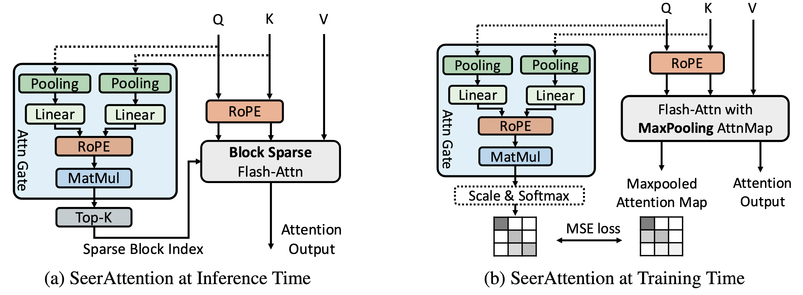

# SeerAttention

SeerAttention is a learning-based method to enable block-level sparse attention for long-context LLM without using prefined static pattern or heuristic methods. It can be applied in Post-training or Fine-tuning stages. The Attention Gate units learn from the intrinsic sparse attention maps generated by your original pre-trained models.  
[[arxiv paper](https://arxiv.org/abs/2410.13276)] 




## Environment
```bash
    conda create -yn seer python=3.11
    conda activate seer
    pip install torch==2.4.0
    pip install -r requirements.txt
```


## Download the pretrained models for experiments
```bash
    mkdir models
    huggingface-cli download meta-llama/Llama-3.1-8B --local-dir  models/meta-llama/Llama-3.1-8B
    huggingface-cli download meta-llama/Meta-Llama-3-8B --local-dir  models/meta-llama/Meta-Llama-3-8B
    huggingface-cli download meta-llama/Llama-3.1-8B-Instruct --local-dir  models/meta-llama/Llama-3.1-8B-Instruct


```


## Post-training with SeerAttention
Only AttnGates are trained in this stages. Run the below script to reproduce the results on llama-3-8B. Once you obtain the model, different sparsity ratios can be applied.
```bash
    bash scripts/run_post_training.sh
```


## Fine-tuning with SeerAttention
Fine-tuning a model in long-context extension with SeerAttention with a fixed sparsity. The current fine-tuning implementation relies on using the backward path of torch sqda kernel, which is slow. Further optimization of our customized training kernel with be developed. 
```bash
    bash scripts/run_seerattn_yarn_finetuning.sh
```

## Experiment with other AttnGate designs
The current AttnGate design is very simple, only a pooling plus linear layer. You can test your own design by using our attention pooling kernels. It is a functional self-attention kernel but also outputs the 2D maxpooled attention map (block-size 64).
```python
    attn_output, pooling_gt = attn_with_pooling(
        query_states,
        key_states,
        value_states,
        True, 
        1.0 / math.sqrt(self.head_dim)      
    )        
```

## Citation

If you find SeerAttention useful or want to use in your projects, please kindly cite our paper:

```bibtex
@article{gao2024seerattention,
  title={SeerAttention: Learning Intrinsic Sparse Attention in Your LLMs},
  author={Gao, Yizhao and Zeng, Zhichen and Du, Dayou and Cao, Shijie and So, Hayden Kwok-Hay and Cao, Ting and Yang, Fan and Yang, Mao},
  journal={arXiv preprint arXiv:2410.13276},
  year={2024}
}

```


## Contributing

This project welcomes contributions and suggestions.  Most contributions require you to agree to a
Contributor License Agreement (CLA) declaring that you have the right to, and actually do, grant us
the rights to use your contribution. For details, visit https://cla.opensource.microsoft.com.

When you submit a pull request, a CLA bot will automatically determine whether you need to provide
a CLA and decorate the PR appropriately (e.g., status check, comment). Simply follow the instructions
provided by the bot. You will only need to do this once across all repos using our CLA.

This project has adopted the [Microsoft Open Source Code of Conduct](https://opensource.microsoft.com/codeofconduct/).
For more information see the [Code of Conduct FAQ](https://opensource.microsoft.com/codeofconduct/faq/) or
contact [opencode@microsoft.com](mailto:opencode@microsoft.com) with any additional questions or comments.

## Trademarks

This project may contain trademarks or logos for projects, products, or services. Authorized use of Microsoft 
trademarks or logos is subject to and must follow 
[Microsoft's Trademark & Brand Guidelines](https://www.microsoft.com/en-us/legal/intellectualproperty/trademarks/usage/general).
Use of Microsoft trademarks or logos in modified versions of this project must not cause confusion or imply Microsoft sponsorship.
Any use of third-party trademarks or logos are subject to those third-party's policies.
