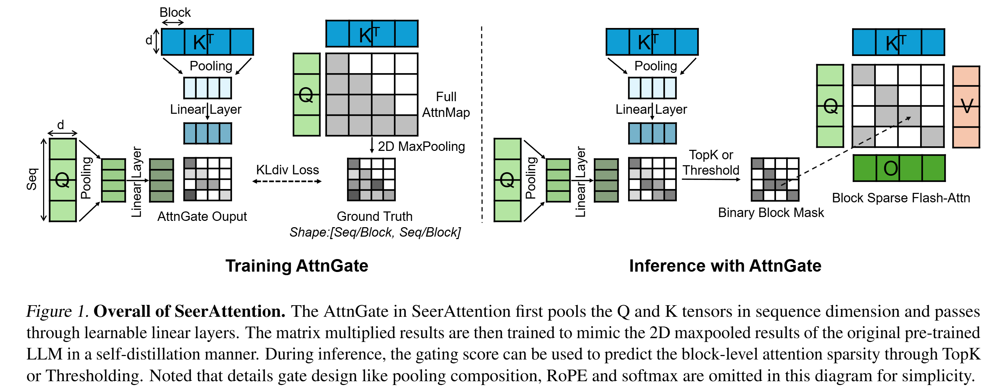

# SeerAttention: Learning Intrinsic Sparse Attention in Your LLMs

[](https://arxiv.org/abs/2410.13276)
[](LICENSE)




Official implementation of **SeerAttention** - a novel trainable sparse attention mechanism that learns intrinsic sparsity patterns directly from LLMs through self-distillation at post-training time. Achieves faster inference while maintaining accuracy for long-context prefilling.


## News
- **2025/3/5**: Release AttnGates of DeepSeek-R1-Distill-Qwen on HF. Release sparse flash-attn kernel with bwd for fine-tuning.
- **2025/2/23**: Support Qwen! Change the distillation into model adapter so that only AttnGates are saved.
- **2025/2/18**: Deepseek's Native Sparse Attention ([NSA](https://arxiv.org/abs/2502.11089)) and Kimi's Mixture of Block Attention ([MoBA](https://github.com/MoonshotAI/MoBA)) all aquire similar trainable sparse attention concepts as us for pretrain models. Great works!


## Key Features
**Trainable Sparse Attention** - Outperform static/predefined attention sparsity    
**Block-level Sparsity** - Hardware efficient sparsity at block level  
**Self-Distillation** - Lightweight training of attention gates (original weights frozen)  
**Efficient Kernel** -  Block-sparse FlashAttention implementation  
**Easy Integration** - Works with existing transformer architectures


## Hugging Face Models
The current codebase is improved by only saving the distilled AttnGates' weights. During inference, you can composed the AttnGates and original base model. Check the latest huggingface repos!

| Base Model             | HF Link                                                                                                                                 | AttnGates Size |
|------------------------|-----------------------------------------------------------------------------------------------------------------------------------------|----------------|
| Llama-3.1-8B-Instruct    | [SeerAttention/SeerAttention-Llama-3.1-8B-AttnGates](https://huggingface.co/SeerAttention/SeerAttention-Llama-3.1-8B-AttnGates)    | 101 MB       |
| Llama-3.1-70B-Instruct   | [SeerAttention/SeerAttention-Llama-3.1-70B-AttnGates](https://huggingface.co/SeerAttention/SeerAttention-Llama-3.1-70B-AttnGates)   | 503 MB       |
| Qwen2.5-7B-Instruct      | [SeerAttention/SeerAttention-Qwen2.5-7B-AttnGates](https://huggingface.co/SeerAttention/SeerAttention-Qwen2.5-7B-AttnGates)         | 77 MB        |
| Qwen2.5-14B-Instruct     | [SeerAttention/SeerAttention-Qwen2.5-14B-AttnGates](https://huggingface.co/SeerAttention/SeerAttention-Qwen2.5-14B-AttnGates)        | 189 MB       |
| Qwen2.5-32B-Instruct     | [SeerAttention/SeerAttention-Qwen2.5-32B-AttnGates](https://huggingface.co/SeerAttention/SeerAttention-Qwen2.5-32B-AttnGates)        | 252 MB       |
| deepseek-ai/DeepSeek-R1-Distill-Qwen-14B     | [SeerAttention/SeerAttention-DeepSeek-R1-Distill-Qwen-14B-AttnGates](https://huggingface.co/SeerAttention/SeerAttention-DeepSeek-R1-Distill-Qwen-14B-AttnGates)        | 189 MB       |
| deepseek-ai/DeepSeek-R1-Distill-Qwen-32B     | [SeerAttention/SeerAttention-DeepSeek-R1-Distill-Qwen-32B-AttnGates](https://huggingface.co/SeerAttention/SeerAttention-DeepSeek-R1-Distill-Qwen-32B-AttnGates)        | 252 MB       |


## Quick Start

### 1. Environment
```bash
conda create -yn seer python=3.11
conda activate seer
pip install torch==2.4.0
pip install -r requirements.txt
pip install -e . 
```


### 2. Inference with AttnGate Adapter
During inference, we automatically compose your original base model with our distilled AttnGates.

SeerAttention supports two sparse methods (Threshold / TopK) to convert a soft gating score to hard binary attention mask. Currently we simply use a single sparse configuration for all the attention heads. You are encourage to explore other configurations to tradeoff the speedup vs quality.
```python
from transformers import AutoTokenizer, AutoConfig
from seer_attn import SeerAttnLlamaForCausalLM

model_name = "SeerAttention/SeerAttention-Llama-3.1-8B-AttnGates"
config = AutoConfig.from_pretrained(model_name)

tokenizer = AutoTokenizer.from_pretrained(
    config.base_model, 
    padding_side="left",
)

## This will compose the AttnGates and base model
model = SeerAttnLlamaForCausalLM.from_pretrained(
    model_name,
    torch_dtype=torch.bfloat16,
    seerattn_sparsity_method='threshold', # Using a threshold based sparse method
    seerattn_threshold = 5e-4, # Higher = sparser, typical range 5e-4 ~ 5e-3
)

# Or using a TopK based sparse method
model = SeerAttnLlamaForCausalLM.from_pretrained(
    model_name,
    torch_dtype=torch.bfloat16,
    seerattn_sparsity_method='nz_ratio', 
    seerattn_nz_ratio = 0.5, # Lower = sparser, typical range 0.1 ~ 0.9
)

model = model.cuda()

# Ready to inference
```

### 3. Training your AttnGates
In the current self-distillation training setup, you can train the AttnGates for your own model. Here we give an example script for Llama-3.1-8B-Instruct. After the distillation process, the AttnGates' weights will be saved.

```bash
## scirpts to reproduce llama-3.1-8b
bash run_distillation.sh
```


## Kernel Library in SeerAttention


### 1. Inference Kernel 
We have a triton version and a CUDA version of 2D block-sparse flash-attn kernel for current SeerAttention inference. By default, the triton kernel is used as backend. The CUDA kernel is still being improved. See `seer_attn/block_sparse_attention` for more details.


### 2. Kernel to generate 2D maxpooled ground truth for self-distillation training
If first compute the intermediate attn-map (softmax(Q*K)) and then perform 2D maxpooled to generate the ground truth, it will cost huge GPU memory due to the quadratic size of the attn-map. Thus, we implement a kernel to directly generate the 2D maxpooled attn-map for efficient self-distillation training process. 


```python
### simple pseudo codo for self-distillation AttnGate training
from seer_attn.attn_pooling_kernel import attn_with_pooling

predict_mask = attn_gate(...)

attn_output, mask_ground_truth = attn_with_pooling(
    query_states,
    key_states,
    value_states,
    is_causal, 
    sm_scale,
    block_size      
)

###...
loss = self.loss_func(predict_mask, mask_ground_truth)   
```

### 3. Fine-tuning kernels (beta)
We implement two different kernels with backward for sparse-atttention-aware fine-tuning.

- Compress the sequence dimention for both Q, K and V. Similar to current SeerAttention Prefill.

```python
from seer_attn import block_2d_sparse_attn_varlen_func

k = repeat_kv_varlen(k, self.num_key_value_groups)
v = repeat_kv_varlen(v, self.num_key_value_groups)
attn_output = block_2D_sparse_attn_varlen_func(
    q, # [t, num_heads, head_dim]
    k, # [t, num_heads, head_dim]
    v, # [t, num_heads, head_dim]
    cu_seqlens, 
    cu_seqlens,
    max_seqlen,
    1.0 / math.sqrt(self.head_dim),
    block_mask, # [bsz, num_heads, ceil(t/block_size), ceil(t/block_size)]
    block_size, # block_size of sparsity           
)
```
- Compress only the sequence dimention of KV while enforcing all the heads within a GQA group share the same sparse mask. This is similar to the find-grained sparse branch of deepseek NSA. 

```python
from seer_attn import block_1d_gqa_sparse_attn_varlen_func

attn_output = block_1d_gqa_sparse_attn_varlen_func(
    q,  # [t, num_q_heads, head_dim]
    k,  # [t, num_kv_heads, head_dim]
    v,  # [t, num_kv_heads, head_dim]
    cu_seqlens, 
    cu_seqlens,
    max_seqlen,
    1.0 / math.sqrt(self.head_dim),
    block_mask, # [bsz, num_kv_heads, t, ceil(t/block_size)]
    block_size, # block_size of sparsity             
)

```
The code for fine-tuning with SeerAttention will be release soon.  


## Evaluation
For efficiency, we evaluate `block_sparse_attn` compared with full attention by FlashAttention-2. 


For model accuracy, we evaluate SeerAttention on PG19, Ruler and LongBench. Please refer to `eval` folder for details. 

## Citation

If you find SeerAttention useful or want to use in your projects, please kindly cite our paper:

```bibtex
@article{gao2024seerattention,
    title={SeerAttention: Learning Intrinsic Sparse Attention in Your LLMs},
    author={Gao, Yizhao and Zeng, Zhichen and Du, Dayou and Cao, Shijie and So, Hayden Kwok-Hay and Cao, Ting and Yang, Fan and Yang, Mao},
    journal={arXiv preprint arXiv:2410.13276},
    year={2024}
}

```


## Contributing

This project welcomes contributions and suggestions.  Most contributions require you to agree to a
Contributor License Agreement (CLA) declaring that you have the right to, and actually do, grant us
the rights to use your contribution. For details, visit https://cla.opensource.microsoft.com.

When you submit a pull request, a CLA bot will automatically determine whether you need to provide
a CLA and decorate the PR appropriately (e.g., status check, comment). Simply follow the instructions
provided by the bot. You will only need to do this once across all repos using our CLA.

This project has adopted the [Microsoft Open Source Code of Conduct](https://opensource.microsoft.com/codeofconduct/).
For more information see the [Code of Conduct FAQ](https://opensource.microsoft.com/codeofconduct/faq/) or
contact [opencode@microsoft.com](mailto:opencode@microsoft.com) with any additional questions or comments.

## Trademarks

This project may contain trademarks or logos for projects, products, or services. Authorized use of Microsoft 
trademarks or logos is subject to and must follow 
[Microsoft's Trademark & Brand Guidelines](https://www.microsoft.com/en-us/legal/intellectualproperty/trademarks/usage/general).
Use of Microsoft trademarks or logos in modified versions of this project must not cause confusion or imply Microsoft sponsorship.
Any use of third-party trademarks or logos are subject to those third-party's policies.
